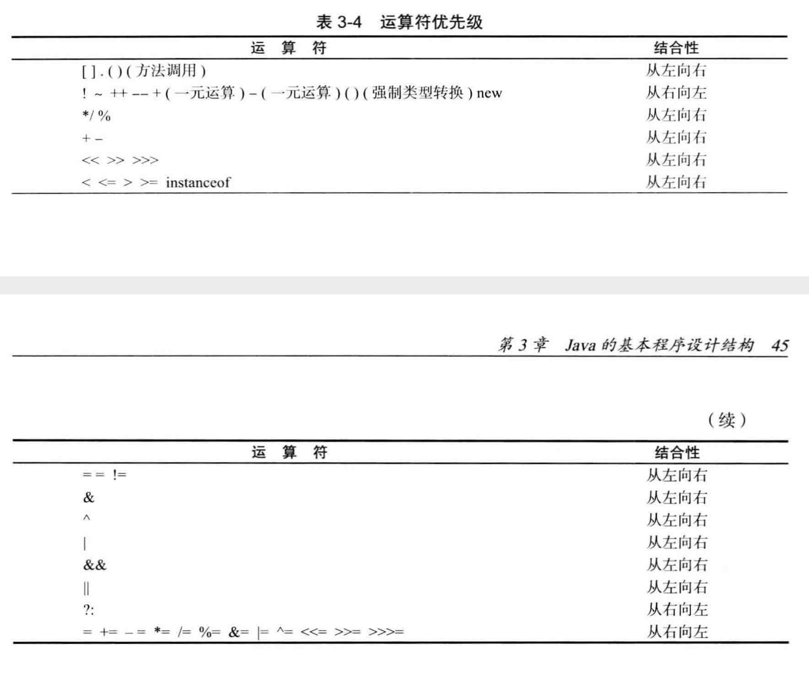
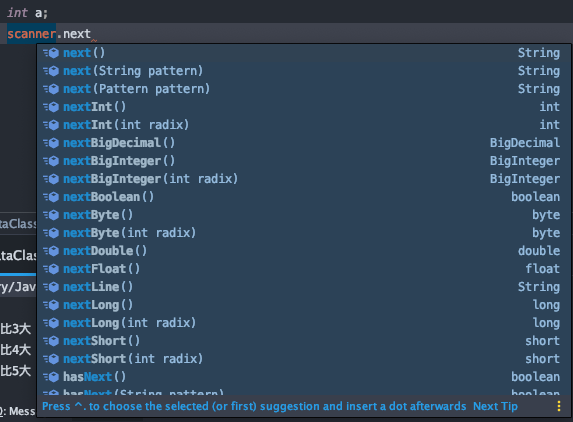
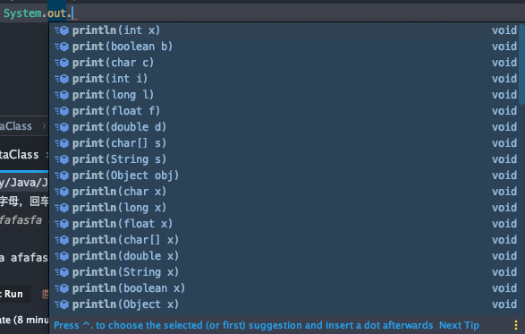
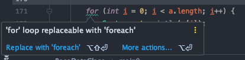
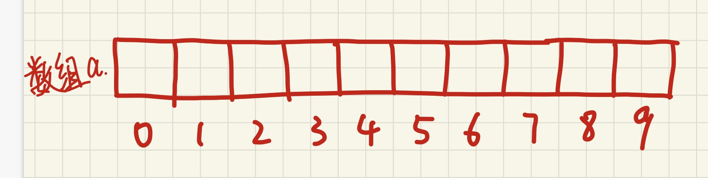
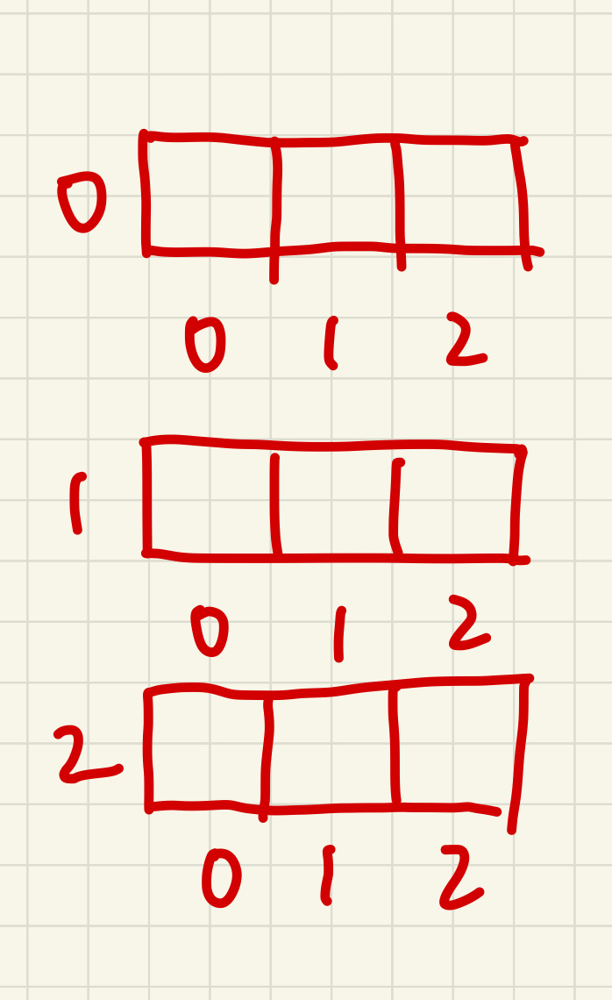

# 2019红岩网校工作站移动开发部Android-第一次课

## 上课前

### 内容梗概

1. 第一学期的学习计划介绍
2. 作业提交Q&A
3. 向学长学姐提问的Q&A
4. 导论
5. 编程语言基本概念
6. 从Hello World讲Java语法
7. 基本数据类型
8. 数据类型见的转换
9. 数据溢出
10. 引用类型
11. Java运算符
12. 运算优先级、结合性
13. 最简单的JavaIO
14. 流程控制，穿插Lv1、2作业讲评
15. 数组，穿插作业Lv3作业讲评
16. 函数(方法)
17. 递归
18. 总结

### 作业提交

1. 首先仔细看看预习作业pdf中的描述

   

2. 错的最多的作业标题：
   **错误示范：**

.assets/错误作业提交1.png)

> 应该是第3次

‘

> level3就行，不需要加空格


> 天翼3G，快人一步

​	**正确示范：**

​	


3. 附件上传方式：

   **大多数的邮箱网页、web都支持直接拖动，将打包好的压缩包拖动到右键正文即可**

4. 压缩文件打包方式：

   
   
   **不会就退群**

### 向学长学姐提问

1. 看图认字


> 遇到问题首先应该做的是利用搜索引擎来解决，通过qq交流一些简单问题可能远没有你看一会书好，书这么厚怎么看我想看到的呢，利用搜索引擎就可以快速定位到自己想要了解的方面。同时，自己独立解决问题会锻炼自己的能力，快速提高。

2. 看图认字

   

> **那么如何截图？看1.看图认字**

3. [提问的艺术]([https://blog.csdn.net/Marksinoberg/article/details/57081440?locationNum=12&fps=1%23%E5%89%8D%E8%A8%80](https://blog.csdn.net/Marksinoberg/article/details/57081440?locationNum=12&fps=1%23前言))

   **我曾经在Android答疑帖中让大家去看了一下这篇读后感博客，可能有同学没有去看，下面是我精简的要点**

   * “他”明明能帮到我，却不帮我。。。

     * 别人帮助了我们，我们自然应该感到荣幸；别人不帮助我们，我们也不要有什么怨言，因为别人没有这个义务花费自己的时间来做一些和自己毫不相关的事（关于帮助别人也是帮助自己这类的理由就不要再说了，说得不好听一点，这也只是个牵强的借口罢了，没有什么意义）。

   * 学会停顿

     * 假设你找到了合适的询问问题的对象，你有很多的问题要咨询，这时千万不要别像机关枪似的一次性“扫射”所有的帮助渠道，这就象大喊大叫一样会令人不快，温柔地一个一个来。

   * 组织你的问题

   * 清晰的发问

   * 礼貌总是有益的


## 正式开始今天的内容

> 有些概念的比喻为了初学便于理解可能不太恰当，大佬们见谅。

### 导论

#### 计算机

临场。

#### 编程

编程相信大家都有所听闻。在做的大家都应该做了作业的吧？再怎么跌跌撞撞都应该把helloworld敲出来了。不难看出一些端倪：

* 英文+英文符号
* 有一定的格式

* 某些如果按照英文文章这么仔细一读好像能读的懂

我们接触的Java是一门高级语言，他已经很接近人的自然语言。对于其他类型的语言来说，可读性是非常高的。

> 向下有汇编语言、机器语言。机器语言是一种二进制代码，由0和1组成，非常不易读。汇编语言用助记符(也是英文)来代替一些机器指令(语言)操作码，已经有一些可读性。

机器是无法直接读出高级语言所表达的意思的，所以我们需要一个工具，将我们所写的高级语言来变成机器所能接受的指令，从而让机器按照我们所想的意思去执行。然而这个工具我们并不关心，我们只关心我们所负责写的高级语言就行了。多加上这一步转化过程是为了提高我们开发的简单度和效率。

#### 程序

摘自百度百科：

它以某些程序设计语言编写，运行于某种目标结构体系上。打个比方，程序就如同以英语（[程序设计语言](https://baike.baidu.com/item/程序设计语言/2317999)）写作的文章，要让一个懂得英语的人（[编译器](https://baike.baidu.com/item/编译器/8853067)）同时也会阅读这篇文章的人（[结构体系](https://baike.baidu.com/item/结构体系/8298791)）来阅读、理解、标记这篇文章。

**非常经典的概念：程序 = 数据结构 + 算法**

这个概念说简单，也不简单，我也说不清楚，只可意会不可言传。

#### Android

中文称安卓，由Google(谷歌)进行开发、更新和维护。他是一种广泛运行在各种设备的开源操作系统。

主要对手是iOS，两个系统有很大的差别，很多东西是不通用的。


#### Android应用程序开发

简而言之就是使用某些编程语言和Android框架来进行程序开发，最终可以在Android系统的设备上运行。


#### Android应用程序开发的简要流程

举个你们大多数人都应该使用过的掌上重邮的**迎新专题**的🌰：

**没用过掌邮的退群**

| 原型图(由产品策划及运营部人员提供)                           | 视觉图PSD(由视觉设计部的人员提供)                            |
| ------------------------------------------------------------ | ------------------------------------------------------------ |
| .assets/image-20191012150457064.png) | .assets/image-20191012150246976.png) |

作为开发人员的我们的工作大体分四部分：

1. 画静态的布局

   .assets/image-20191012150927423.png)

2. 写页面的逻辑

   .assets/image-20191012145948949.png)

3. 省略非常超久的debug的过程

4. 打包编译成apk，然后就成为了你们手中的可以运行的app。

### 编程语言基础

1. 二进制的简单介绍

一种逢2进1的进制，即只使用0、1来表示数值。在计算机技术中广泛利用。机器可以使用高低电平来表示二进制，二进制可以用来表示数字，用数字就可以表示字母。。。依次类推，从而造就我们如今的信息时代。下面是(8bit原码表示)举例：

0=0000 0000

1=0000 0001

2=0000 0010

3=0000 0011

4=0000 0100

5=0000 0101

6=0000 0110

7=0000 0111

8=0000 1000

9=0000 1001

10=0000 1010


不用担心，仅作为了解，现阶段不需要特别深入。

2. 位 bit

位作为信息中的最小单位。一位就表示一个二进制数字。

8bit = 1Byte	1024 Byte = 1Kb

1024Kb = 1Mb	1024m = 1Gb

> 实际上 1000Byte = 1kb 1024Byte = 1kib kib才是真正的千位二进制码的单位(后面以此类推)，目前kb和kib已经混淆，内容比较复杂，有兴趣的可以bing搜索相关信息。

3. JDK(Java Development Kit---Java 开发工具包)

最近可能很多同学被这个东西所困扰，装JDK就可以搞一天。

JDK(Java Development Kit) 是整个JAVA的核心，包括了Java运行环境（Java Runtime Envirnment），一堆Java工具（javac/java/jdb等）和Java基础的类库（即Java API 包括rt.jar）。

总之JDK实际上是一个工具包，他包含了很多很多的和Java有关的开发组件，使得我们可以使用Java语言进行编程，所以JDK是非常重要且必要的。


4. JRE(Java Runtime Environment---Java运行环境)j

JRE包含了一个Java虚拟机(JVM)和一些标准类别库函数

标准类别库函数(Java 8)包含：

**lang包：**
	该包提供了Java语言进行程序设计的基础类，它是默认导入的包。该包里面的Runnable接口和Object、Math、String、StringBuffer、System、Thread以及Throwable类需要重点掌握，因为它们应用很广。
**Util包：**
	该包提供了包含集合框架、遗留的集合类、事件模型、日期和时间实施、国际化和各种实用工具类（字符串标记生成器、随机数生成器和位数组）。
**IO包：**
	包括支持输入和输出功能的类和接口
**sql包：**
	该包提供了使用Java语言访问并处理存储在数据源（通常是一个关系型数据库）中的数据API。
**net包:**
	封装了网络层，应用层：http协议，和传输层：tcp/udp的一些协议
**text包：**
	提供了与自然语言无关的方式来处理文本、日期、数字和消息的类和接口。
**awt包:**
	包含了构成抽象窗口工具集类
等等


不用担心，不用背，你用着用着就懂了。


简单来说，虚拟机就是让你来运行Java程序的，标准类别库函数就是那些`printf`等等常用的东西.

> 现在你安装了JDK会自动带上JRE一套了

5. 我们使用的ide(Integrated Development Environment---集成开发环境)

* IDEA
  * 我们在本学期初期使用它进行Java的学习
* Android Studio 
  * 在学习完基本的Java知识之后，我们会使用Android Studio来学Android的相关知识，Android Studio同时也是Google官方的推荐Android开发者使用的IDE。注意，学习Android的过程实际上不断地穿插着Java的学习，并不是进入Android后就不需要学Java了。

> 中途更换成AS并不会消耗繁重的学习成本，因为实际上AS就是魔改的Idea。所以我们也强烈推荐使用Idea作为学习Java的编译器。


### HelloWorld

那我们先开始~~魔改的~~HelloWorld吧√

```java
public class Lv0 {
    public static void main(String[] args) {
      	String str = "Hello world!"
        System.out.println(str);
    }
}
```


### 通过HelloWorld对一些基本术语的介绍

#### 变量、变量声明 

* 不知道的退群
```Java
类型 变量名;
int a = 7;
String str;
```

#### 常量、常量声明

* 一旦定义就不会再改变的量
```Java
public static final 类型 常量名 = 值; //常量代码格式是规定的
public static final String CONST = "红岩网校nb"
```

#### 语句
被执行的东西。在Java中以分号结束。
如：

```Java
System.out.println("红岩网校nb");
```

#### 表达式
被评估、求值的东西。

百科：

表达式，是由数字、[算符](https://baike.baidu.com/item/算符/4923983)、数字分组符号（括号）、自由变量和约束变量等以能求得数值的有意义排列方法所得的组合。约束变量在表达式中已被指定数值，而自由变量则可以在表达式之外另行指定数值。

```Java
//逻辑表达式
3 > 2 //true
a > b //?
```

#### 合法、非法

指对语法的正误


#### 逻辑错误


代码是符合语法规范的，但是你的逻辑是有错的。


#### 代码块
被花括号括起来的东西:
```Java
for (int i = 0; i < 10; i++) {
		//这里是代码块
}

{
	//这里也是代码块
  //在代码块中声明的变量只在代码块中是可见的。
  int a = 10;
}
System.out.println(a); //非法
```

#### 函数/方法
* 现在讲不清楚

#### main函数
* 程序的入口，Java程序从main开始。
* main函数执行完毕，Java程序终止。


#### 注释

```java
//这里不会被编译和执行
//int a = 10；
//可以用来”控制变量法debug“，注释掉相应的语句，既可以做到既保留它，有不让他进行编译
```


### 基本数据类型

#### 整型：

* byte  1字节 1*8 = 8位  范围 -128-127（-2的7次方到2的7次方-1）

* short  2字节 2*8 = 16位 范围 -32768~32767（-2的15次方到2的15次方-1）

* int 	4字节  4*8 = 32 位  范围 -2147483648~2147483647 （-2的31次方到2的31次方-1）

* long  8字节 8*8 = 64位 范围 -9223372036854774808~9223372036854774807  （-2的63次方到2的63次方-1）

  
  
  > 为什么范围都是	 $$-2^{n-1}$$  ~  $$2^{n-1}-1$$	呢？
  >
  > 实际上最高位是用来表示正负数的，其他的位数才表示数值
  >
  > 有点复杂，涉及二进制的补码表示法，这里不多赘述，请Bing/Google

#### 浮点型：

* float 4字节 4*8 = 32位 范围 -3.40E+38 ~ +3.40E+38 精度 6~7位(2^23)
  * 1bit（符号位） 8bits（指数位） 23bits（尾数位）
* double 8字节 8*8 = 64位 范围 -1.79E+308 ~ +1.79E+308 精度 15~16位
  * 1bit（符号位） 11bits（指数位） 52bits（尾数位）


#### 布尔类型：

* boolean	位数不定，只有true和false两个值

#### 字符类型：

* char	2字节 2*8 = 16位 使用Unicode编码来表示字节，不过Unicode的0~127是和ASCII码相同的。

  > 在C语言中，char只占1个字节。

等等？[ASCII](https://baike.baidu.com/item/ASCII)？？？


### 基本类型的自动(隐式)转换
* 语法：
	没有语法，由JVM自动实现，数值范围小的可以自动转换成数值范围大的。
* 例子：
```Java
//自动类型转换
        int a = 65;
        System.out.println(a); //65
        double b = a;
        System.out.println(b);
//        char c = a; //非法
        char c = 'A';
        int value = c;  //合法
        System.out.println(value);
```

### 基本数据类型的显式(强制)转换

* 语法：
  **(基本数据类型)变量名/值**
  **由于各个基本数据类型的范围，储存方式，储存位数不同，数值范围大的数据类型转向数值范围小的数据类型可能会造成精度丢失**
* 例子：
```Java
//强制类型转换
        int a = 65;
        System.out.println(a);
        double b = (double)a;
        System.out.println(b);
        System.out.printf("%f",b);
        char c = (char)a;
        System.out.println(c);
        int a2 = (int)'A';
        System.out.println(a2);
```

> ASCII码表自查

### 数据溢出
* 当我们的值超过当前基本数据类型的范围时，数据会溢出
* 例子：
```Java
 //数据溢出
        int MAX_INT = Integer.MAX_VALUE;
        System.out.println(MAX_INT);
        System.out.println(MAX_INT+1);
```
* 溢出机制涉及二进制，感兴趣的可以下去了解，这里不多赘述

### 引用类型

* 数组😁

* 类😅

* 接口😅

* 枚举😅

* 标注😭

  

**目前你们可能只接触到了数组，后面我们会陆陆续续接触其他引用类型**

### String

字符串，是非常常用的一个类(?)。

顾名思义，就是可以有多个字符的串。

String使用的是双引号，char使用的是单引号。

```Java
String str = "Hello world!";
char c = 'H';
```

#### 字符串转换基本数据类型

一个纯数字的字符串可以转化成基本数据类型(除了char)

```java
String str = "1234";

        int i = Integer.parseInt(str);
        long l = Long.parseLong(str);
        float f = Float.parseFloat(str);
        double d = Double.parseDouble(str);
```

#### 字符串拼接

+号即可

```java
String str1 = "听红岩网校上课也就图一乐";
String str2 = "真想学点技术还得多看看书";
String str3 = str1 + str2 + "。";
```


### Java运算符
#### 1. 算术运算符
* +、-、 *、 / 	**不会就退群**
  
* 值得注意的是，+号同时可以用来String拼接。
  
* % 可能有些同学没有用过，我们一般叫他 模(mo)
  

  

  模运算实际上就是一个求余数的计算

  🌰：
```Java
  //模运算
        int a = 10;
        int mo = 10 % 3;
        System.out.println(mo);
```
* ++(自增)、--(自减)，实际上就是加一或者减一的操作，但是写法有一点小区别，需要特别注意。
```Java
//自增
        int a = 10;
        a++;
        ++a;
        System.out.println("当前a " + a);
        System.out.println("打印++a "+(++a)); //先自增，再返回
        System.out.println("当前 "+a);
        System.out.println("打印a++ "+a++);	//先返回，再自增
        System.out.println("当前a "+a);
        System.out.println();
//自减
        int b = 10;
        b--;
        --b;
        System.out.println("当前b "+b);
        System.out.println("打印--b "+(--b)); //先自减、再返回
        System.out.println("当前 "+b);
        System.out.println("打印b-- "+b--);	//先返回、再自减
        System.out.println("当前b "+b);
```
#### 2.赋值运算符
* = 	**不会就退群**
* +=、-=、*=、/=、%=	这个举个栗子可能比较好理解
```Java
//赋值运算符
				int a;
        a = 10;
        System.out.println(a);

        a += 10;
//        a = a + 10;
        System.out.println(a);

        a -= 10;
//        a = a - 10;
        System.out.println(a);

        a *= 10;
//        a = a * 10;
        System.out.println(a);

        a /= 10;
//        a = a / 10;
        System.out.println(a);

        a %= 3;
//        a = a % 3;
        System.out.println(a);
```

#### 3. 关系运算符
关系运算符，他们返回的值就应该是一个boolean值

* ==（判等）、 !=  （判等的否定）
  
  > 特别注意，两个等号==是判等，一个等号=是赋值  

* <、<=、>、>= 同上

算了还是给个例子：
```Java
//关系运算符
        int a = 3;
        int b = 2;
        boolean isABigger = a > b;
        System.out.println(isABigger);
        if (a > b) {
            System.out.println("a is bigger then b.");
        } else if (a < b) {
            System.out.println("b is bigger then a.");
        } else {
            System.out.println("a == b");
        }
```
#### 4. 逻辑运算符
* && 与
	当两边都为true时结果才是true，其他情况都为false。
* || 或
	当两边都是false时，结果才是false，其他情况都是true。(即满足两边条件的其中一个就是true，当然两个同时满足也可)
* ！非
	取当前boolean值的反
🌰：
```Java
				if (a > b && a < b){
            System.out.println("不可能输出我");
        }
        if (a > b || a < b){
            System.out.println("只要a!=b的话就会输出我");
        }
        if (!(a > b)){
            System.out.println("当a不大于b时，即a小于等于b时输出我");
        }
        if (!(a < b)){
            System.out.println("当a不小于b时，即a大于等于b时输出我");
        }
```
#### 5. 条件运算符
* 语法：
```Java
条件表达式 ? 若为是则返回这个 : 若为否则返回这个
```


	🌰：
```Java
				int c = a > b ? 1 : 0;
        System.out.println(c);
```

#### 6. 位运算符
> 涉及二进制操作，仅供了解

* & 按位与
	
	* 和逻辑运算符相同，用1来表示true、0来表示false，然后做逻辑与运算。

```Java
 				int a = 3;  
        int b = 1;
        int c = a & b;
        System.out.println(c);
```
>3的二进制是 011 、1的二进制是001(省略高位)
>01 1
>00 1
>——
>011
>一位一位的进行逻辑与，最后结果是 001，即二进制的1

* | 按位或，处理方式同按位与，做逻辑或运算

* ^ 按位异或，处理方式同按位与，但是按位做的逻辑运算规则是：

  * 如果两位数字不同，则结果为1，否则为0

    > 011
    > 001
    >——
    > 010
    >
    > 所以 3~1 的结果是 2

* ~ 按位取反，以32位int为例

  > 0 000 0000 0000 0000 0000 0000 0000 0011
  >
  > ———————————————————
  >
  > 1 111 1111 1111 1111 1111 1111 1111 1100
  >
  > 1 111 1111 1111 1111 1111 1111 1111 1100被储存在计算机中
  >
  > Java中有符号整数为补码表示法。最高位是符号位，符号位为1就是负数，0就是正数。
  >
  > 对于正数：补码 = 原码 = 反码
  >
  > 对于负数：补码 = 原码取反 +1
  >
  > 所以这里  原码 = ~(补码 - 1)
  >
  > 所以  补码-1：1 111 1111 1111 1111 1111 1111 1111 1011
  >
  > 所以  原码:      1 000 0000 0000 0000 0000 0000 0000 0100
  >
  > 0100是4，符号位为1，所以这个原码的十进制是-4
  >
  > 所以 ~3 的结果是 -4


* `>>`右移运算符，将二进制右移若干位，正数左补0、负数左补1，右边丢弃

  🌰：

  `a>>1`

  0000 0011 = 3

  0000 0001 = 1

* << 左移运算符，将二进制左移若干位，左边的二进制位丢弃，右边补0

  > 左移时对不对最高位(即符号位)进行操作。

  🌰：

  <<1

  0000 0010 = 2

  0000 0100 = 4

  << 4

  0000 0010 = 2

  0010 0000 = 64

  

  好神奇，实际上就是做乘法运算！

  << 1

  0000 0011 = 3

  0000 0110 = 6

  对的，实际上左移一位就是原数值*2。

* `>>>`无符号右移运算符

  实际上就是连着符号位一起向右移动，正数负数左边都补0，最后是多少就是多少

* &=、|=、^=、>>=、<<= 这几个都和之前的+=类似。

* 不同位数的位运算时，正数左边补满0，负数补满1，然后在做位运算。


看不懂怎么办，没事，你不懂的还多着 

很多人都是第一次接触二进制，看不懂真的很正常，我们之后的学习其实用二进制的地方其实很少。但是二进制却是计算机的基础，所以还是建议大家课下去多多学习和了解。


### 运算符优先级、结合性

不多BB，看图就行了，不作为重点，记不到的用括号就行。



什么是结合性呢？
```Java
int a = 1;
int b = 2;
a = b;	//赋值运算符的结合性是从右到左，所以该赋值语句的意思是b赋值给a;
int c = a - b; //减号运算符的结合性是从左到右，所以该语句的意思是a减去b，而不是b减去a，这两个差别还是很大的
```

### 最基础而且最简单的输入输出，即IO流(input、output)

##### 1. 输入： `Scanner`
在没有理解面向对象之前，可能大家无法理解一下操作，都是以死记硬背的方式
```Java
Scanner scanner = new Scanner(System.in);
int a = scanner.nextInt();
```
然而本节课我们也不会将有关面向对象的知识，面向对象是下节课的内容，这里不赘述，仅仅讲述用法。





不要害怕，都是字面意思。

* `Scanner.next()`在输入有效字符之后，如果你输入了空格、tab、回车被视为停止读取，之后按下回车键代表继续。即，next不能拿得到带空格的字符串。

* `Scanner.nextXXX()`意思就是获得我们输入的下一个XXX，并返回\n

* `Sacnner.nextLine()`意思就是获得你按下Enter键之前的所有字符，可以带空格。

> next()和nextLine()接连使用时会有问题，你的空格、tab、Enter键没有被next()读走，nextLine()会将其读走，导致问题的发生，所以我们建议尽量少使用next()

##### 2. 打印输出：`System.out.println()` 

害，其实是有些可讲的东西的，比如：




* `System.out.println(XXXX);`(快捷键sout) 最最最常用且常用的打印方式。几乎什么都可以打印。值得注意的是他输出之后会自动换行。
* `System.out.print(XXXX);`同样是打印，但是他不会换行，而且光标会停留在行首。
* `System.out.printf(XXXX);`和上面的几乎一样，但是多了一个f代表着他有不一样的功能，格式化输出，格式化的内容比较多，学过C语言的同学应该有所了解，这里和c基本一样，平时用的不多。一般使用的是以+号拼接字符串代替(虽然可能会有性能消耗)。

以上的输入、输出方法足以应对我们目前的学习，关于其他流(如文件流的读取、写入)一是涉及面向对象，二是我们学习并不会用，所以我们不多赘述，感兴趣可以自行Google/Bing `JavaIO流`


### 流程控制

#### 条件语句

* if-else	相信大部分的同学都已经用过了
	* 对应概率论中的对立事件，非A及B
```Java
if(逻辑表达式A){
	语句A
} else{
	语句B
}
```

* else if	就是在if-else的基础上多加几种特殊情况
```Java
if(逻辑表达式A){
	语句A
} else if (逻辑表达式B){
	语句B
} else if (逻辑表达式C){
	语句C
} else {
	语句D
}
```

* switch-case  和else if 类似，但是同时也有不一样的地方
	* if-else/else-if会在一个条件表达式后直接命中，而switch-case语句可以选择直接命中、连续命中。
	* switch语句判断的是值是否相同，而if-else/else-if判断的是逻辑表达式
```Java
switch(变量值){
	case 可能的值A:
		语句A;
		break;
	case 可能的值B:
		语句B;
		break;
	case 可能的值C:
		语句C;
	case 可能的值D:
		语句D;
		break;
	
}
//代码示例
				int a = 0;
        Scanner scanner = new Scanner(System.in);
        a = scanner.nextInt();
        int b = 3;
        switch (a-b){
            case 0:
                System.out.println("输入的数与3相等");
                break;
            case 1:
                System.out.println("输入的数比3大");
            case 2:
                System.out.println("输入的数比4大");//错误
            case 3:
                System.out.println("输入的数比5大");//错误
                break;
            default:
                System.out.println("输入的数比3小");
        }
```

#### 循环语句
* while
```Java
while(逻辑表达式){
	语句;
}
```
运行到while语句时
**1.首先判断逻辑表达式的布尔值，true则执行一次下面的代码块，false则不执行该while语句**

**2.执行完成后再次判断逻辑表达式的布尔值，重复1，构成循环**

while循环常见的模式:

```java
        //死循环
        while(true){
						//do something
          	if(条件){
              break;
            }
        }

        
        //规定次数的循环
        int a = 10;
        while(a > 0){
            a--;
            //do something
        }
```

* do-while
```Java
do{
	语句;
}while(逻辑表达式)
```
**与while语句相似，不过首先无条件执行一次代码块，再判断逻辑表达式**

* for **最最最常用的循环**相信大家已经提前接触过了
```Java
for(语句A;逻辑表达式;语句集){
	//do something
}
```
运行到for语句时
**1. 首先执行语句A**
**2. 然后判断逻辑表达式的true/false,true则执行代码块,false直接跳过循环**
**3. 每次运行完代码块后，执行语句集(使用逗号分隔开)，然后重复2，构成循环**
⬆️务必仔细阅读循环流程，根据问我的同学的情况来看，很多错误都出在这里
`for`循环常见模式：

```Java
//死循环
				for(;;){
            //do something
        }
        
//规定次数的循环
				for (int i = 0; i < 10; i = i + 2) {
            //do something
        }
```

* `foreach`循环——增强型的for循环，针对数组(集合)遍历
🌰:
```Java
				int a [] = {1,2,3,4,5};
        for (int number :
                a) {
            System.out.println(a);
        }
        //等价
        for (int i = 0; i < a.length; i++) {
            System.out.println(a[i]);
        }
```

同时，Idea建议我们使用foreach来取代用于遍历数组的for循环



#### 循环流程控制

* `break;`
  * 终止整个循环
* `continue;`
  * 跳过本次循环，开始下一次循环，需要重新判断逻辑表达式。


#### Lv1、2作业讲评

* 穷举


### 数组

数组是非常常用的一种数据结构。他们在内存中通常是连续的。


数组就是好像一个个连续的小格子，用来存放一连串的数据，每个数据我们叫他们**元素**，每个数据都有一个下标来表示他的位置，我们叫它**下标(索引)**，它通常**从0开始计数**。



上图所示，数组a长度为10，下标从0-9。

所有的数据类型都可以作为一个数组，不管是基本数据类型还是引用类型，都可√。

* 一维数组
```Java
int[] array  = new int[7];	//声明一个数组长度为7的int数组,并全部初始化为0
int[] array  = {1,2,3,4,5,6,7}	//声明一个长度为7的int数组，并初始化
int[4] array  = {1,2,3,4};		//不合法
String[] str = new String[9];
//访问
int temp = array[6]; //7
array[6] = 8;
```
一维数组就和上面的图一样

* 二维数组
```Java
int array [][] = new int [3][4];	//声明一个3*4的二维数组
int array [][] = {{1,2,3},
                  {1,2,3},
                  {1,2,3}};	//声明一个3*3的二维数组
//访问
int temp = array[0][2]; //3
```


~~第一维数组存的是第二维数组的引用(指针)~~

实际上，可以看做、表示为：一个**矩阵**(线性代数)、一个**有限的空间直角坐标系**(想一想，为什么)

* N维数组
```Java
int[][][][][] array ... = new int [][][][]... 
```
一般来说二维以上的数组在(我们)日常的开发中很少使用，而且比较难理解。但在**算法**的世界，多维数组却是经常使用的。

#### Lv3作业讲评

* 排序算法


### 函数(方法)
main函数(方法)应该是你们遇见的第一个函数。
```Java
public static void main(String[] args) {
		
}
```
为了化简，我们来看看下面的这个函数，它的作用是拼接一个字符串并返回：

```Java

 	public static String changString(String str){
			String change = str + "真想学点技术还得看书学习";
      return change;
	}
public void foo(){
  
}


//使用它时(省略上下文)
String string = changString("红岩网校听课也就图个乐,");
System.out.println(string);
```


* 什么是函数

  函数你可以看成一个**封闭**的机器，有一个输入口，有一个输出口，有一个按钮。输入口即上面中的`(String str)`我们称之为**参数**，输出口则代表着`public String changeString(String str)`中的第一个String，我们称之为**返回值**。当然，一个机器可以没有输入，也没有输出，但是它确确实实做了点事情，当然也可以作为一个函数，我们称他们**无返回类型**。在下面的使用的时候，我们只看到了`changeString("红岩网校听课也就图个乐,")`，这样的形式叫做**函数的调用**。形象比喻就是我吧`"红岩网校听课也就图个乐,"`放入这个**封闭**的机器的输入口，按下按钮(调用)，然后输出的值是一个`"红岩网校听课也就图个乐,真想学点技术还得看书学习"`并将其赋值给string。

* 为什么强调是**封闭**的呢？

  **封闭是因为我们这里只知道他的函数名以及需要的参数和期望的值，而不知道他到底是如何实现的，就好像一个精密的机器，你知道他可以干嘛，但是你对他的内部工作原理并不关心。用就对了。**⬅️**请务必理解这句话**

* 函数的结构

```
  访问修饰符 (static) 返回值 函数名(参数){
  	具体实现
  }
```

.assets/image-20191013113540027.png)

* 方法？

  * 在(面向对象的)Java中我们一般都将函数称为方法。实际上是一个东西。下节课会详细介绍。

### 递归

**如果不知道递归的意思的话，请看上面的标题。**

### 总结


作为红岩网校移动开发部Android的第一节课，也就意味着这个是一个基础课程，我也承认本节课的内容非常的多，不过做了对应预习的同学来讲可能相对轻松，但是相信只要花时间都是可以能够弄懂的。弄懂了本节课的内容，对学校里教的不管是C还是C艹都会有很大的帮助。

万事开头难，加油吧少年。

## 下节预告

下节课将是面向对象的Java，上了那节课大家都可以有对象啦


**内部资料，请珍惜我们的劳动成果，请勿外传。**

© 红岩网校工作站移动开发部 