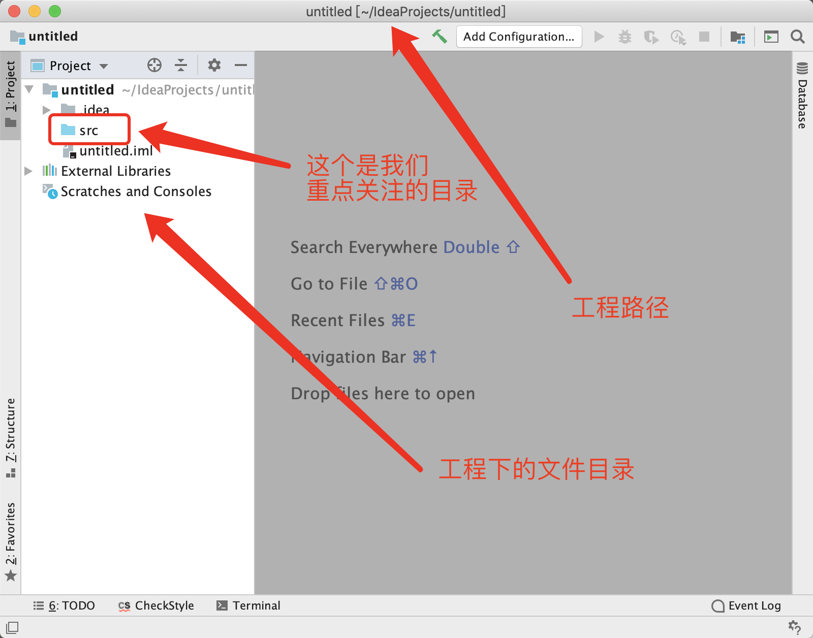
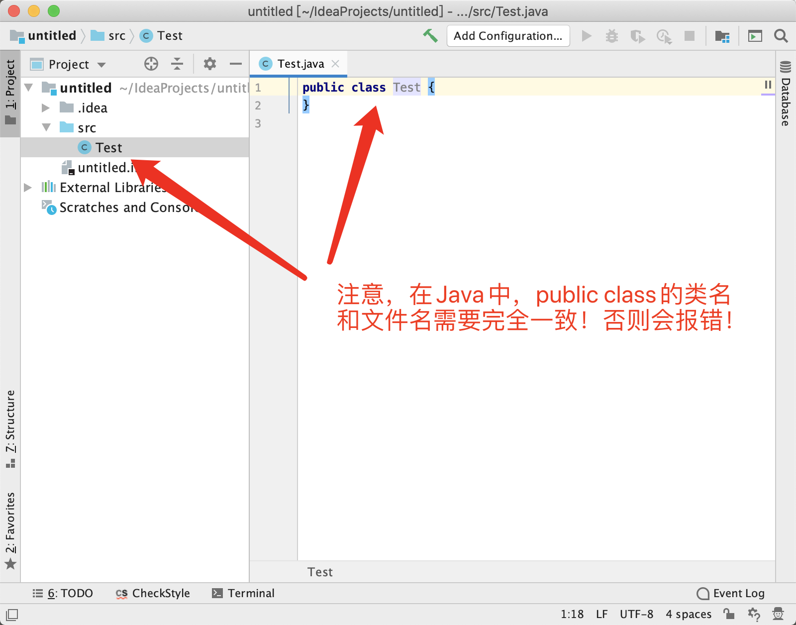

## 2019红岩网校工作站移动开发部Android方向学习资料——IDEA的基本操作

本篇将将介绍一些idea的基本操作。由于我暂时没有Windows电脑，这里使用的系统是Mac，但是操作都是基本相同的。

### 创建工程

首先先找到这个

或者这个

然后请下一步、下一步

到了这里需要特别注意

然后finish完成创建

### 新建`.Java`文件

嗯。。。之前的由于我用了主题可能图标颜色会有点和你们不太一样，现在换回来了

一个刚刚创建的空工程大概是这样

我们的所有写的所有java文件都在src文件夹里，要创建.java文件当然在src文件夹里创建，所以我们右键src文件夹来新建(或者选中src文件夹，按ctrl+n快捷键（mac是command+n）)，出现如下：

我的天！好多！不多需用担心，我们只需要第一个Java Class即可，点击Java Class，随后出现如下页面：

在Name处输入你的文件名，回车即可。下面的是啥？不用管，以后你就知道了。

### 快捷键

* psvm+回车 快速创建main函数

  

* sout+回车 快速打出`System.out.println();`

  

* fori+回车 快速打出规定次数的for循环

  

  如下，i处填上循环数字即可

  

* foreach+回车 快速打出增强型for循环(针对遍历)

  

  如下：用法Bing、Google

  

* 撤销操作 ctrl + z (mac为commad+z)

* 更多快捷键，自行Bing/Google，或者将鼠标放置在某些按钮上去了解他的快捷键

了解快捷键有助于提高你的开发效率

### 运行`main`函数

有些同学可能会问我明明有main函数了，但是我怎么运行图标是灰色的呢？

以为idea不知道你要启动哪里的main函数，点击你想运行的main函数(或者所在类)旁边的绿色运行图标，然后run即可

然后就可以在运行图标里快捷运行了：

判别的Test就是main函数所在类名的名字，注意不要混淆了，当你在另外的类新建一个main函数的时候如果不点击新添加的main函数的小三角可能就运行错main函数了。

### 程序流程控制

* run模式：

  

  * 重新运行
  * 终止程序
  * 其他的目前不需要

  > Tips:当你发现你的终止程序是红色的时候，就代表程序目前仍在运行，所以可以终止，如果不是你想让她一直运行，那么可能就是有问题了（处于死循环或者在疯狂计算、输出）

* debug模式：

  看下文

### 在idea里操作文件

* 所有操作都可以在右键找到，并对应了他的快捷键

  

* 重命名:

  

* 移动文件，直接拖动文件到想要移动到的位置即可

* 复制粘贴剪贴，同系统

### 目前常见的错误

#### 语法错误

* 缺少符号
* 变量名不合法
* ......

#### 没有导入包

典型错误：

使用alt+enter（mac option+enter）进行自动导入

#### 异常

* 空指针异常——NullPointerException

  

* 数组越界异常——ArrayIndexOutOfBoundsException

  

* 其他异常——请前往Bing/Google

为什么发生这些错误需要你们自己去寻找原因，但是Jvm已经告诉了你很多信息，比如错误发生的位置，点击就可以看到，遇到未知的/没见过的错误，**直接复制错误的名称去Bing。**

### 如何debug——使用debug模式

* 首先，什么是debug调试

  **debug调试可以让你的程序在你所想要的位置停下来，然后从这里开始一步一步在你的控制下进行，与此同时你可以查看在这里这一阶段的变量值等重要信息，是检查程序错误的最有效手段，也是我们必须掌握的技能。**

  
#### 首先，进入debug模式

1. 首先，在任意一行的左侧点击，会出现标记。

2. 点击运行旁边的一个像虫子一样的图标，打开debug模式

3. 通过提供的信息，有助于你发现问题所在。

#### 使用debug模式：

找到如下一栏：

* 让程序继续运行直到再次遇到断点
* 让目前的程序暂停（可能会造成异常、为灰色时不可用）
* 显示所有的断点
* 取消所有的断点，然后点击这个的话就会持续运行下去

还有这里：

* 表示Debugger的页面，即当前页面
*  控制台表示我们看输入输出的地方
* 不会进入函数内部，吧函数调用看做一步，这个调试速度较快，使用的比较多。
*  单步执行，遇上函数就会进入到函数内部进行调试，适用于非常仔细的寻找错误点。

### 总结

IDEA是我们学习Java的工具，所以以上基本操作是我们必须要掌握的。但是也不是让你们马上全部学会，随着使用次数的增加，自然就会烂熟于心。

**内部资料，请珍惜我们的劳动成果，请勿外传。**

© 红岩网校工作站移动开发部 

